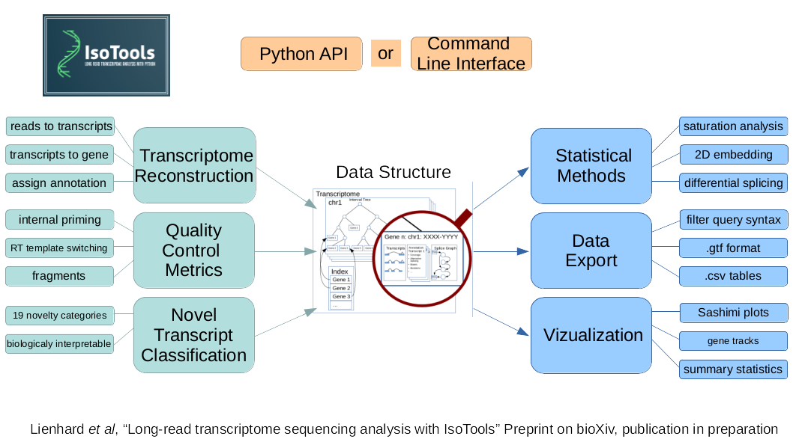

Getting Started
===============
IsoTools is a python module for Long Read Transcriptome Sequencing (LRTS) analysis.

Key features:

* Import of LRTS bam files (aligned full length transcripts).
* Import of reference annotation in gff3/gtf format.
* Computation of quality control metrics.
* Annotation and classification of novel transcripts with biologically motivated classification scheme.
* Definition of alternative splicing events based on segment graphs.
* Detection of differential alternative splicing between samples and groups of samples. 
* Data visualization. 

Installation
------------
The package can be installed with pip:

.. code-block:: bash

    python3 -m pip install isotools

Usage
-----
This code block demonstrates the basic file import with isoseq. For a more comprehensive real world example see the tutorial. 

.. code-block:: python

    from  isotools import Transcriptome
    import logging
    logging.basicConfig(format='%(levelname)s:%(message)s', level=logging.INFO)
    isoseq=Transcriptome.from_reference('reference_file.gff3.gz')
    isoseq_bam_fn={'sample1':'isoseq_fn_s1.bam', 'sample2':'isoseq_fn_s2.bam'}
    groups={'sample1':'control', 'sample2':'treatment'}
    for sa,bam in isoseq_bam_fn.items():
        isoseq.add_sample_from_bam(bam, sample_name=sa, group=groups[sa]) 
    isoseq.add_qc_metrics('genome.fa')
    isoseq.make_index()
    isoseq.add_filter()
    isoseq.save('example_isotools.pkl')

Citation and feedback
---------------------
* If you run into any issues, please use the `github issues <https://github.com/MatthiasLienhard/isotools/issues>`_ report feature. 
* For feedback, please write me an email to `lienhard@molgen.mpg.de <mailto:lienhard@molgen.mpg.de>`_.
* If you use isotools in your publication, please cite the following [paper](https://doi.org/10.1093/bioinformatics/btad364): Lienhard et al, Bioinformatics, 2023: IsoTools: a flexible workflow for long-read transcriptome sequencing analysis
